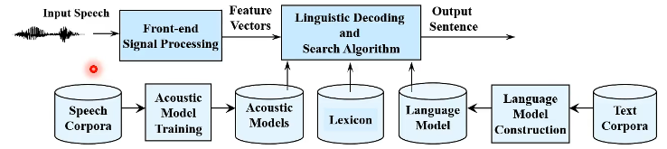
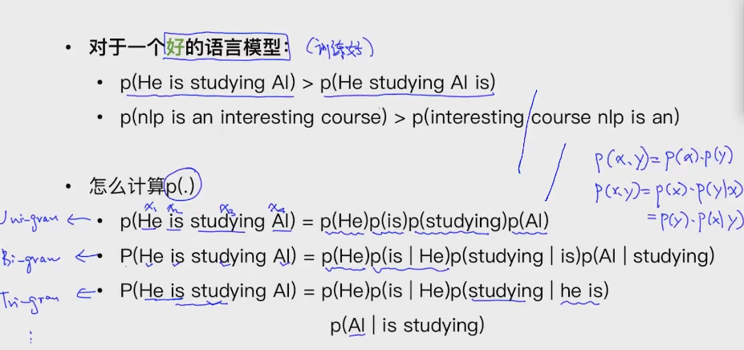

遇事不决，Deep Learning ，硬train一发

### 主要使用的六个模型

- 输入：语音    输出：文字 —— 语音辨识

- 输入：文字    输出：语音 —— 语音合成

- 输入：语音    输出：语音 —— 语音转换

- 输入：文字    输出：文字 —— 

- 输入：语音    输出：对象 —— Speaker Recognition 、Keyword Spotting

- 输入：文字    输出：对象 —— 

  

Traditional Speech Recognition

Automatic Speech Recognition 

(ASR) https://ai.googleblog.com/2019/03/an-all-neural-on-device-speech.html

| 模块名称     | 主要内容                                                     | 案例                             |
| ------------ | ------------------------------------------------------------ | -------------------------------- |
| 文本预处理   | 文本处理基本方法, 文本张量表示, 文本数据分析, 文本增强方法等 | 路透社新闻类型分类任务           |
| 经典序列模型 | HMM与CRF模型的作用, 使用过程, 差异比较以及发展现状等         |                                  |
| RNN及其变体  | RNN, LSTM, GRU模型的作用, 构建, 优劣势比较等                 | 全球人名分类任务, 英译法翻译任务 |
| Transformer  | Transformer模型的作用, 细节原理解析, 模型构建过程等          | 构建基于Transformer的语言模型    |
| 迁移学习     | fasttext工具的作用, 迁移学习理论, NLP标准数据集和预训练模型的使用等 | 全国酒店评论情感分析任务         |

黑马相关文件链接

pytorch：http://121.199.45.168:8020/1/

自然语言处理入门：http://121.199.45.168:8005/

文本预处理：http://121.199.45.168:8003/1/#11

经典序列模型：http://121.199.45.168:8004/1/

RNN及其变体：http://121.199.45.168:8002/1/

Transformer：http://121.199.45.168:8001/1/

迁移学习：http://121.199.45.168:8007/1/

NLP = NLU(语音/文本 -> 意思 understanding) + NLG(意思 -> 文本/语音 Generation)

挑战点：

1. Multiple ways to express（一个意思多种表达）
2. Ambiguity（一词多义）

 

简单机器翻译组成

- translation model 
- language model

### NLP应用场景

- 问答系统
- 机器翻译
- 自动摘要
- 聊天机器人
- 信息抽取*

### NLP技术四个维度

- semantic（语义）

- syntax（句子结构）

  句法分析CYK算法、依存分析

- morphology（单词）

  单词层面的技术（分词、词性、NER命名实体识别)）

- phonetics（声音）