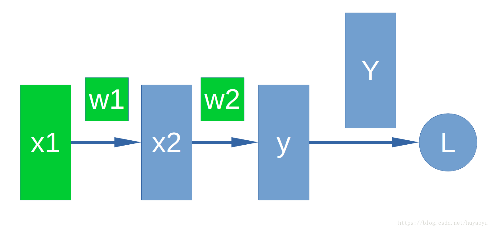
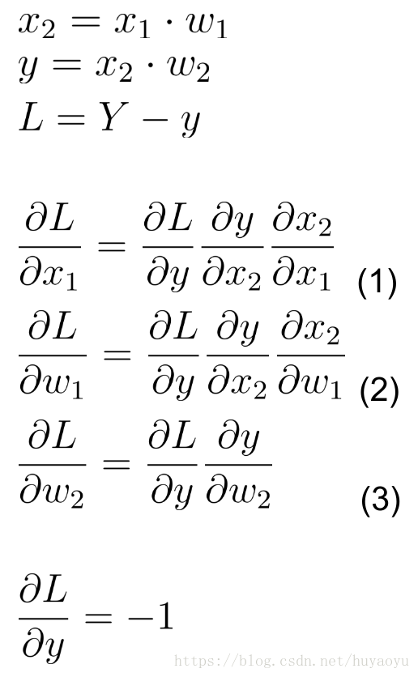
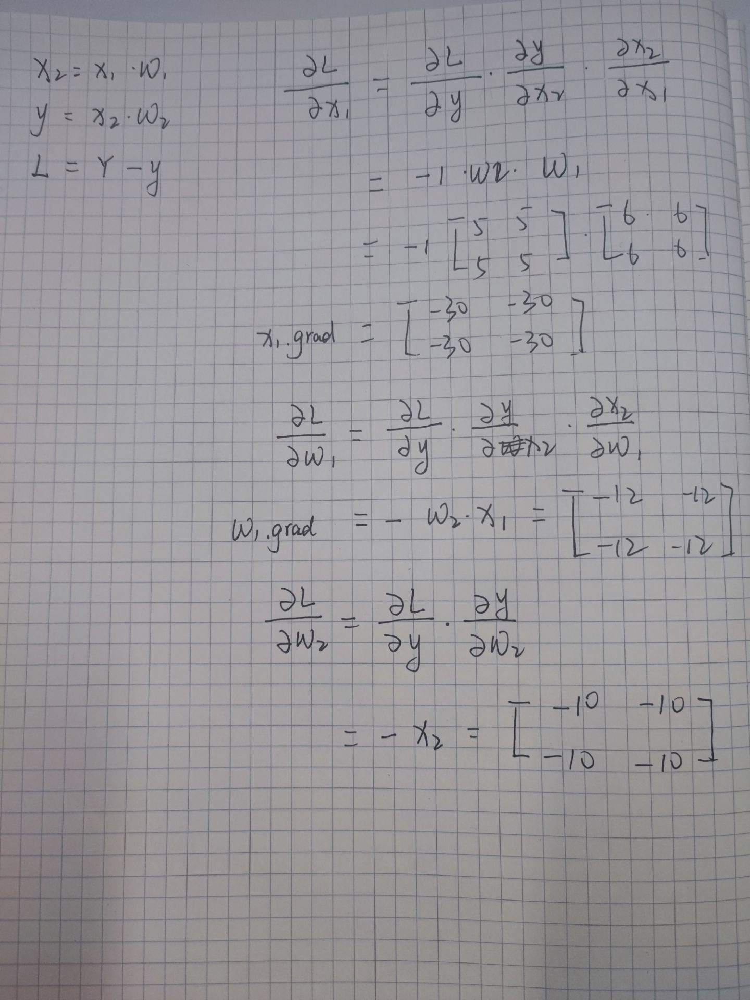

在整个Pytorch框架中, 所有的神经网络本质上都是一个autograd package(自动求导工具包)

- autograd package提供了一个对Tensors上所有的操作进行自动微分的功能.

torch.Tensor

- torch.Tensor是整个package中的核心类, 如果将属性.requires_grad设置为True, 它将**追踪在这个类上定义的所有操作**. 当代码要进行反向传播的时候, **直接调用.backward()就可以自动计算所有的梯度**. 在这个Tensor上的**所有梯度将被累加进属性.grad**中.
- 如果想终止一个Tensor在计算图中的追踪回溯, 只需要执行.detach()就可以将该Tensor从计算图中撤下, 在未来的回溯计算中也不会再计算该Tensor.
- 除了.detach(), 如果想终止对计算图的回溯, 也就是不再进行方向传播求导数的过程, 也可以采用代码块的方式with torch.no_grad():, 这种方式非常适用于对模型进行预测的时候, 因为预测阶段不再需要对梯度进行计算.

torch.Function

- Function类是和Tensor类同等重要的一个核心类, 它和Tensor共同构建了一个完整的类, 每一个Tensor拥有一个.grad_fn属性, 代表引用了哪个具体的Function创建了该Tensor.
- 如果某个张量Tensor是用户自定义的, 则其对应的grad_fn is None.

### Tensor操作

```python
x1 = torch.ones(3, 3)
print(x1)

x = torch.ones(2, 2, requires_grad=True)    # .requires_grad_()可以改变Tensor的属性 
print(x)

y = x + 2
print(y)

print(x.grad_fn)
print(y.grad_fn)

z = y * y * 3
out = z.mean()	# 得平均数，具有squeeze()功效，消除指定维度
print(z, out)
```

```python
tensor([[1., 1., 1.],
        [1., 1., 1.],
        [1., 1., 1.]])
##########################
tensor([[1., 1.],
        [1., 1.]], requires_grad=True)
##########################
tensor([[3., 3.],
        [3., 3.]], grad_fn=<AddBackward0>)
##########################
None
<AddBackward0 object at 0x10db11208>
##########################
tensor([[27., 27.],
        [27., 27.]], grad_fn=<MulBackward0>) tensor(27., grad_fn=<MeanBackward0>)
```

### 梯度Gradients

Pytorch中, 反向传播是依靠.backward()

```python
x = torch.ones(2, 2, requires_grad=True)  # 追踪在这个类上定义的所有操作
print(x)
y = x+2
print(y)
z = y*y*3
print(z)
a = z.mean()  # 得平均数，具有squeeze()功效，消除指定维度
print(a)
a.backward()  
print(x.grad)		# d(a)/d(x) =(d(a)/d(z)) * (d(z)/d(y) * (d(y)/d(x))) 
				   # =1/4 *6*y = 1.5*[[3, 3], [3, 3]]=[[4.5, 4.5], [4.5, 4.5]] 
```

```python
tensor([[1., 1.],
        [1., 1.]], requires_grad=True)
tensor([[3., 3.],
        [3., 3.]], grad_fn=<AddBackward0>)
tensor([[27., 27.],
        [27., 27.]], grad_fn=<MulBackward0>)
tensor(27., grad_fn=<MeanBackward0>)
tensor([[4.5000, 4.5000],
        [4.5000, 4.5000]])

```

关于backward的理解

官方：如果需要计算导数，可以在Tensor上调用.backward()。		 1. 如果Tensor是一个标量（即它包含一个元素的数据），则不需要为backward()指定任何参数 2. 但是如果它有更多的元素，则需要指定一个gradient参数，它是形状匹配的张量。

首先说一下叶子Tensor，例如我们的模型是这样的：

- 首先创建Tensor x1，w1和w2。
- x2 = x1 * w1
- y = x2 * w2
- L = Y - y



x1，x2是神经网络的中间层，y是我们的输出层，Y是真值，L是我们的loss。w1和w2是对应于x1和x2的weight。通常我们会把x1，x2，y，w1和w2使用PyTorch的Tensor进行表示。L也可以用Tensor表示，可能与其他Tensor的维度都不同。在上述模型中，x1，w1和w2就是所谓的叶子Tensor。

```python
import torch
import numpy as np

x1 = torch.from_numpy(2 * np.ones((2, 2), dtype=np.float32))
x1.requires_grad_(True)
w1 = torch.from_numpy(5 * np.ones((2, 2), dtype=np.float32))
w1.requires_grad_(True)
print("x1 =", x1)
print("w1 =", w1)

x2 = x1 * w1
w2 = torch.from_numpy(6 * np.ones((2, 2), dtype=np.float32))
w2.requires_grad_(True)
print("x2 =", x2)
print("w2 =", w2)

y = x2 * w2
Y = torch.from_numpy(10 * np.ones((2, 2), dtype=np.float32))
print("y =", y)
print("Y =", Y)

L = Y - y
print("L =", L)

L.backward(torch.ones(2, 2, dtype=torch.float))

print(x1.grad)
print(w1.grad)
print(w2.grad)
```

```python
x1 = tensor([[2., 2.],
        [2., 2.]], requires_grad=True)
w1 = tensor([[5., 5.],
        [5., 5.]], requires_grad=True)
x2 = tensor([[10., 10.],
        [10., 10.]], grad_fn=<MulBackward0>)
w2 = tensor([[6., 6.],
        [6., 6.]], requires_grad=True)
y = tensor([[60., 60.],
        [60., 60.]], grad_fn=<MulBackward0>)
Y = tensor([[10., 10.],
        [10., 10.]])
L = tensor([[-50., -50.],
        [-50., -50.]], grad_fn=<SubBackward0>)
tensor([[-30., -30.],
        [-30., -30.]])
tensor([[-12., -12.],
        [-12., -12.]])
tensor([[-10., -10.],
        [-10., -10.]])
```



