机器学习流程：

- 数据获取
- 特征工程
- 建立模型
- 评估与应用

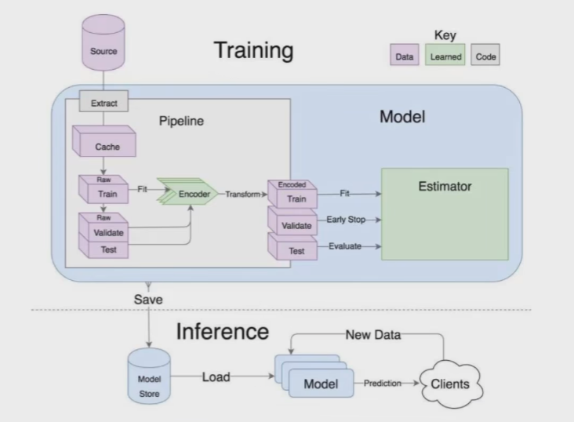

特征工程的作用：

- 数据特征决定了模型的上限
- 预处理和**特征提取**是最核心的
- 算法与参数选择决定了如何逼近这个上限

## 神经网络

### 线性函数

输入到输出的映射 f(x, W) , x 为数据， W为权重参数，也叫得分函数

f(x, W) = W x (+ b)

b为偏置

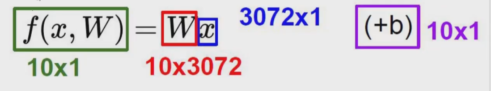

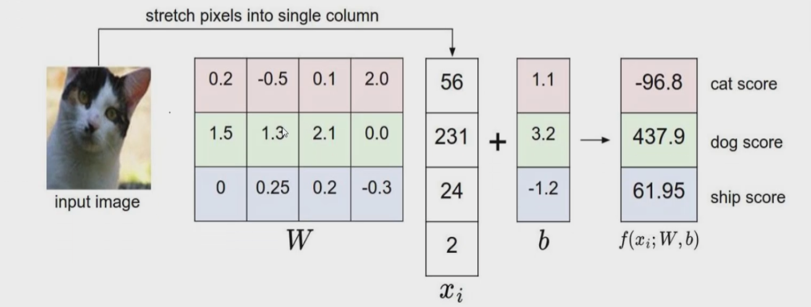

W的行数表示分类数，列数与数据x的数量保持一致

权重参数通过神经网络的训练逐步趋向于正确的方向

### 损失函数

损失函数决定神经网络的用途

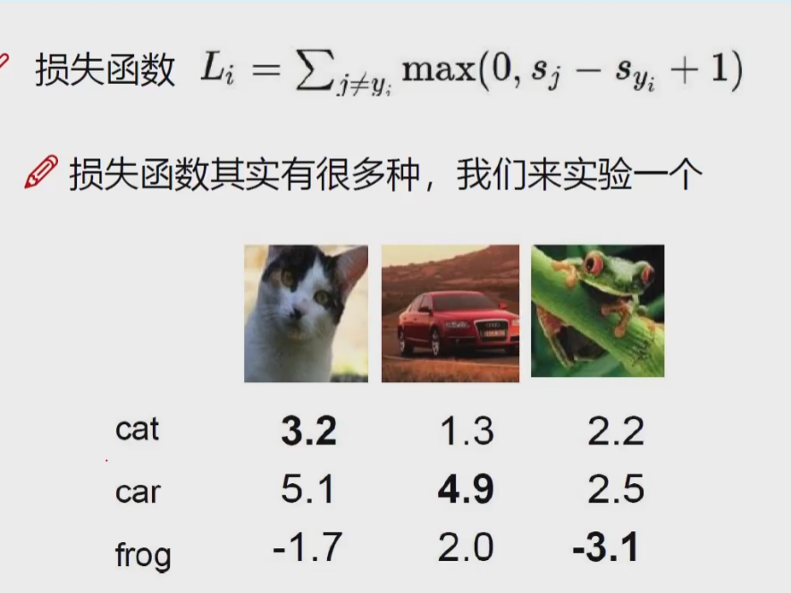

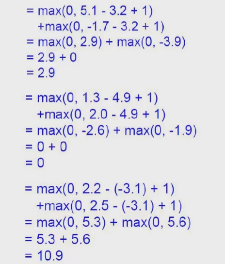

损失函数的值越小，代表效果越好，为0代表没有损失，这里的损失函数里的+1就是为了避免相近混淆的情况

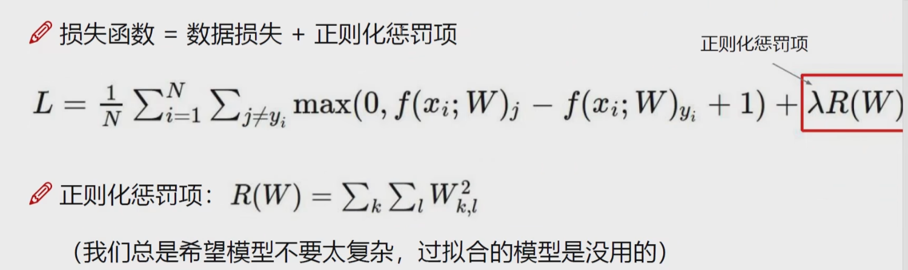

神经网络太强大可能会导致模型过拟合，正则化惩罚项是抑制过拟合的方法

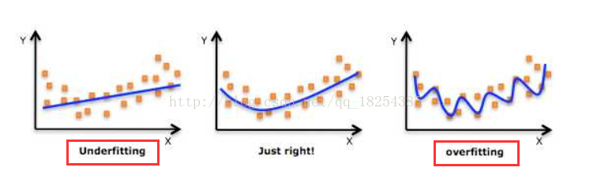

### 欠拟合和过拟合的理解

- 欠拟合：提取的特征比较少，导致模型无法匹配或是无法识别。

  欠拟合常发生在训练刚开始的时候，即训练不够。如果一直存在欠拟合，可以适当增加网络复杂度或在增加特征点。

- 过拟合：建立的模型太过强大细致，对训练集的表现很好，但是对同类型的其他测试集表现差，例如：识别狗的模型，在训练的过程中把二哈的特征都涵盖了，导致后面识别金毛识别不出来。性能的角度上讲就是协方差过大，测试集上的损失函数会表现的很大

  过拟合的主要原因一般为参数过多和数据集较小，一般使用正则化、DROP-OUT来增强抗拒拟合的能力

  DROP-OUT 就是在训练过程中每一层都随机不使用一些神经元，使神经网络简单化，防止过拟合

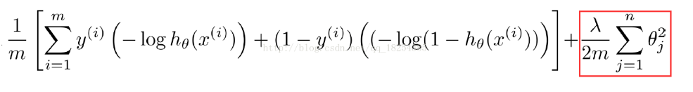

λ过大则会导致后面部分权重比加大，那么最终损失函数过大，从而导致欠拟合，λ过小时，甚至为0，导致过拟合。

### Softmax分类器

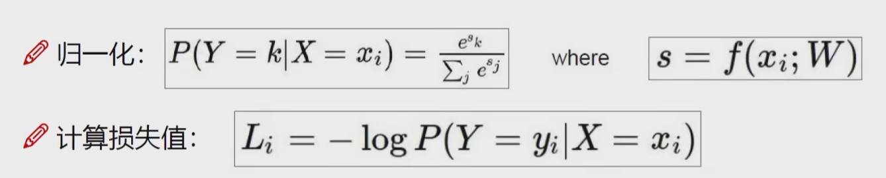

将前面的得分归一化后转化成概率然后计算损失，使用对数后，P属于（0，1），所以log P属于（-∞， 0），所以加负号，L越小，P越大，越符合

**回归任务由得分计算损失，分类任务由概率计算损失**

### 前向传播

前向传播即通过一系列计算得出损失值

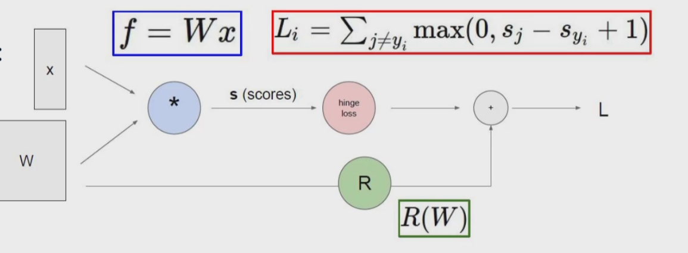

### 反向传播

梯度下降，反向求偏导，梯度是一步步逐层计算的，计算得到的梯度相乘

常见门单元：

- 加法：均等分配
- 乘法：互换
- max：给最大的

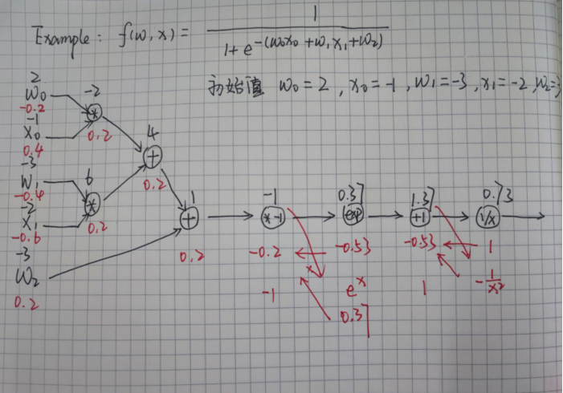

### 整体架构

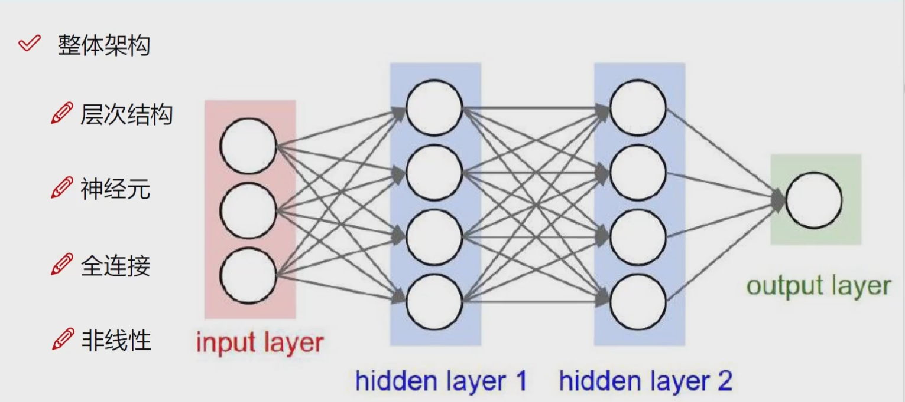

- 层次结构：神经网络是一层一层的，输入层和输出层中间包含数据操作的隐藏层
- 神经元：单个特征点
- 全连接：每一个特征都参与所有的操作
- 非线性：每一步矩阵计算之后的映射操作

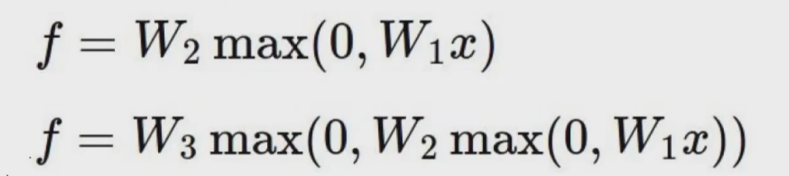

https://cs.stanford.edu/people/karpathy/convnetjs/demo/classify2d.html

神经网络分类演示

### 正则化的作用

惩罚力度都结果的影响：λ越小，在训练集上的表现越好，但可能会过拟合，模型的好坏程度取决于测试集的表现

### 参数个数对结果的影响

神经元个数越多，过拟合的可能性越大

### 激活函数

- sigmoid

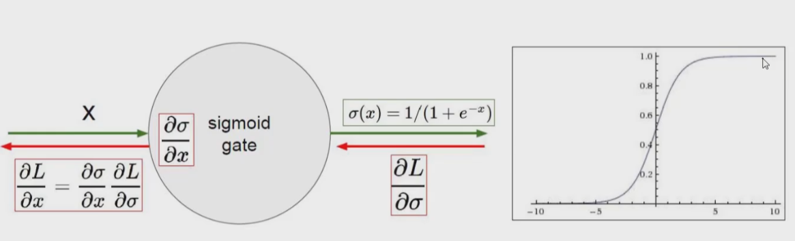

当数值过大时，导数可能为0，导致梯度消失

- Relu

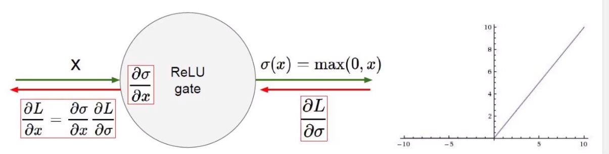

### 数据预处理

数据标准化：去中心化后进行放缩

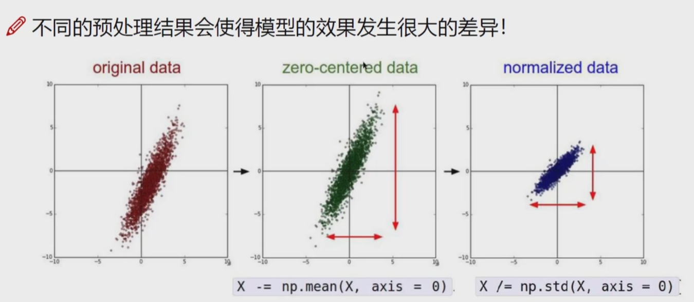

### 参数初始化

通常使用随即策略进行参数初始化

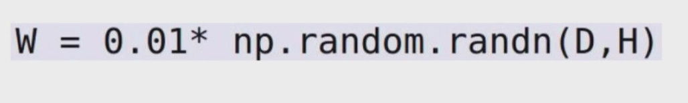
