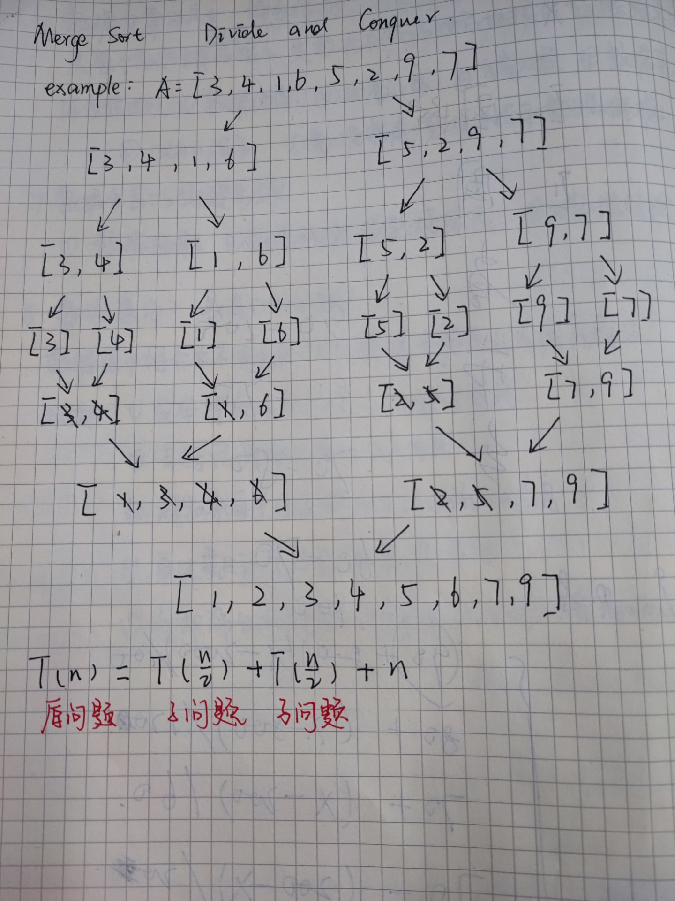
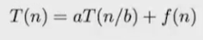
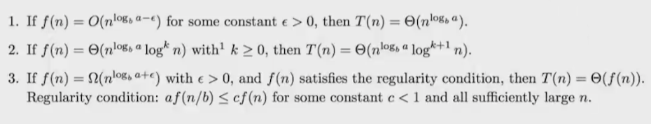
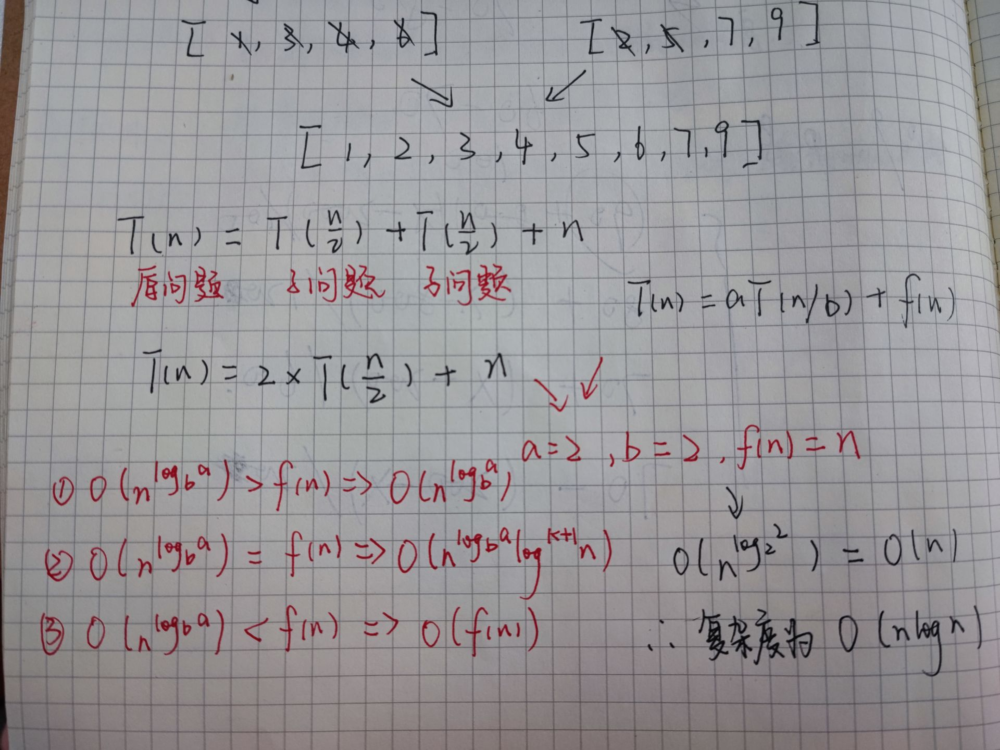
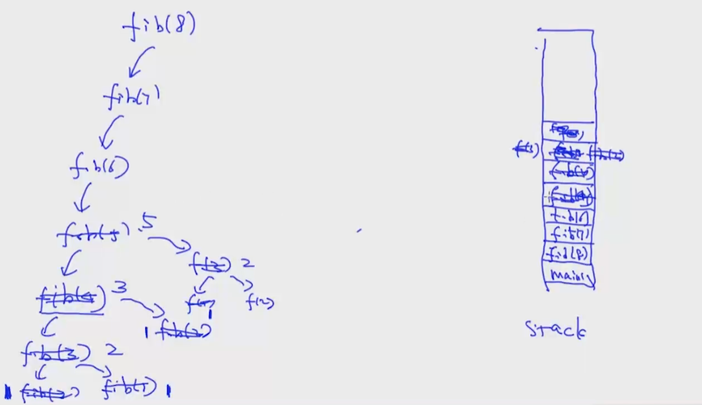

### 算法复杂度

常说的算法效率高低，指的是算法的复杂度

复杂度分为时间复杂度和空间复杂度，一般考虑的情况是n足够大时的时间复杂度

常见的复杂度有O(1)  O(n)  O(n^2) O(log(n)) O(nlogn)等

### Merge sort （归并排序）



### Master Theorem(主定理)







### Fibonanci Number（递归树）

```python
# 递归实现（可用DP（Dynamic Pregnancy）算法优化）
def fib(n):
    # base case
    if n < 3:
        return 1
    return fib(n - 2) + fib(n - 1)


print(fib(40))
# 时间复杂度为O(2^n)
# 空间复杂度为O(n)
```



```python
# 循环实现，DP优化
def fib(n):
    tmp = np.zeros(n)
    tmp[0] = 1
    tmp[1] = 1
    for i in range(2, n):
        tmp[i] = tmp[i-2] + tmp[i-1]
    return tmp[n-1]


print(fib(70))
# 时间复杂度O(n)
# 空间复杂度O(n)
```

### P、NP、NP Hard、NP Complete

···