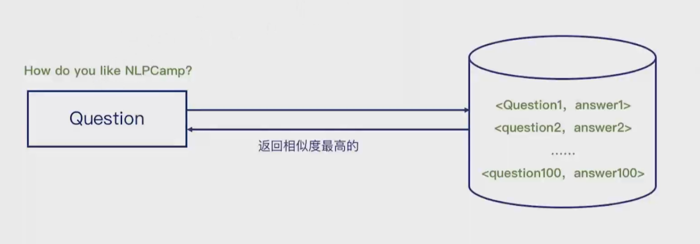
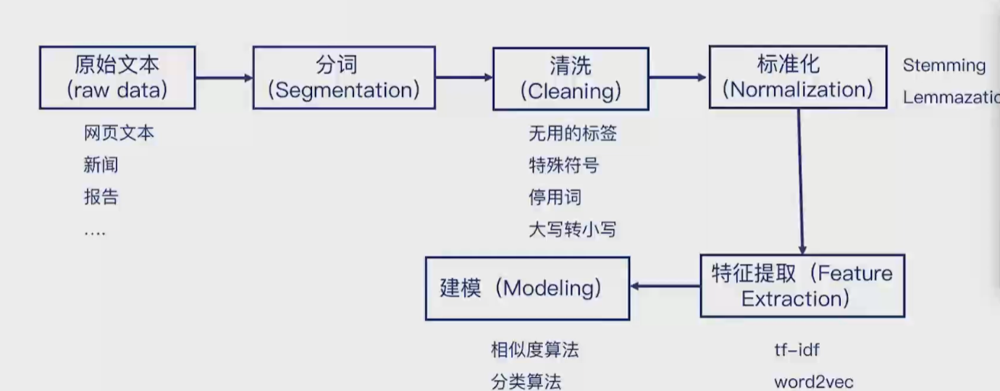
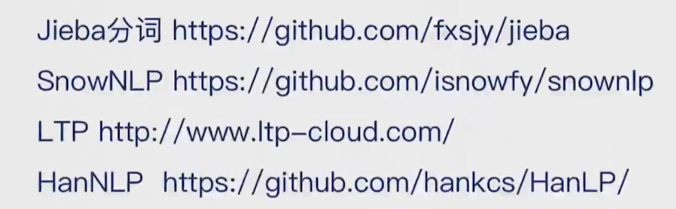
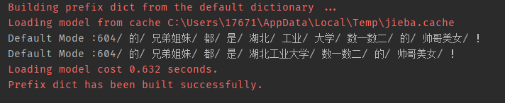
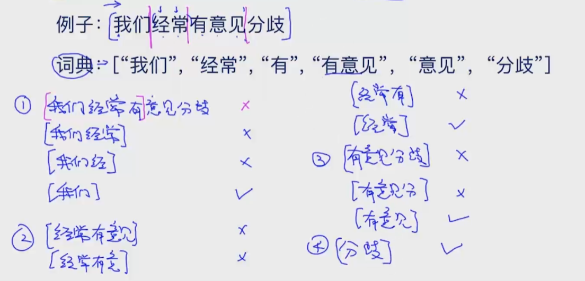
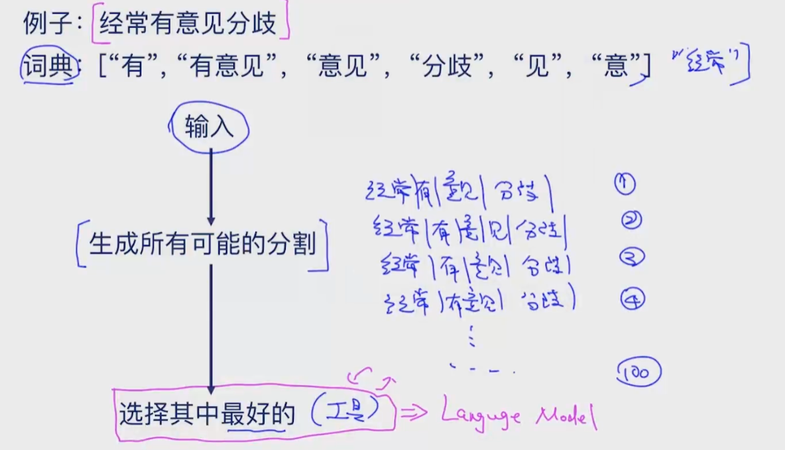

根据已有常见问题构建语料库来搭建智能客服系统

基本思路：判断用户提出的问题与已有问题的相似度来进行回答

正则或规则适用于没有数据的时候

概率 ——> 训练数据



```
FAQ:例：
1.本课程是线上课程还是线下课程?
回答:线上课程为主
2.课程有助教吗
回答:每门课程都配备专业助教
3.学习周期是多久啊?
回答:通常来讲在3-4个月不等
4.如果不满意可以退款吗?
回答:前两周提供无条件退款
5.老师都是什么背景啊?
回答:绝大部分都是全美前10学校的博士
6.课程会有考试吗
回答:有的，一般包括期中和期末
7.我只有编程基础，可以报名吗
回答:对于初级的项目班只要求编程基础
8.课程有实操吗
回答:大部分都是实操，动手能力是最重要的
9.课程为什么贵?
回答:跟别的知识付费不一样，我们会提供很多教学服务，辅助完成学员做完所有的项目
10.课程学完了能做什么?
回答:可以找相关岗位的工作问题不大
11.课程多久开一次啊?
回答:我们每个月开一期，但价格通常会不断升高
```

## NLP系统的构建步骤：

- 分词
- 预处理
  - 拼写纠正spell correction
  - 标准化 stemming lemmazation
  - 清洗、停用词过滤 stop words
  - 特殊字符过滤 words filter
- 特征提取，文本转向量
  - tf-idf
  - word2vec
- 建模、计算相似度（相似度算法、分类算法）
- 排序（相似度）
- 异常过滤（可以有）
- 返回结果

知识图谱的关键点是实体抽取和关系抽取，

目前使用的方法的关键是文本的表示和相似度计算



### 分词  Word Segmentation



常用分词工具

- Jieba分词https://github.com/fxsjy/jieba

​		Jieba是最常用的中文分词工具

- SnowNLP https://gjithub.com/isnowfy/snownlp

- LTP http://www.ltp-cloud.com/

- HanNLP https://github.com/hankcs/HanLP/

```python
# 使用jieba分词
import jieba

seg_list = jieba.cut("604的兄弟姐妹都是湖北工业大学数一数二的帅哥美女！", cut_all=False)
print("Default Mode :" + "/ ".join(seg_list))

jieba.add_word("湖北工业大学")
seg_list = jieba.cut("604的兄弟姐妹都是湖北工业大学数一数二的帅哥美女！", cut_all=False)
print("Default Mode :" + "/ ".join(seg_list))

```



#### Segmentation Method 1： Max Matching（最大匹配）

前向最大匹配（forward-max matching）

选择一个最大匹配窗口，然后依次减小长度，知道与字典中已有内容相匹配 



后向最大匹配，反过来即可

最大匹配算法是一种贪心算法，

缺点：

- 只能是局部最优
- 细分之后有可能是更好的
- 效率偏低
- 不能考虑语义
- 单词——>句子/句法——>语义，最大匹配只是单词层面的算法

#### Segmentation Method 2： Incorporate Semantic（考虑语义）



常用工具：Unigram Language Model 基于统计概率

计算联合概率的时候一般在概率P的前面加log防止underflow


### 拼写纠错  Spell Correction

### 